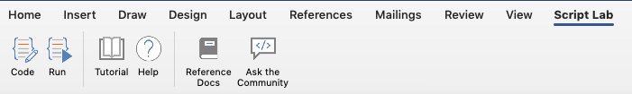
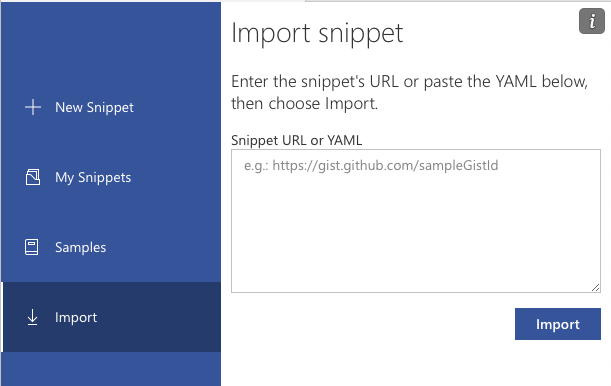
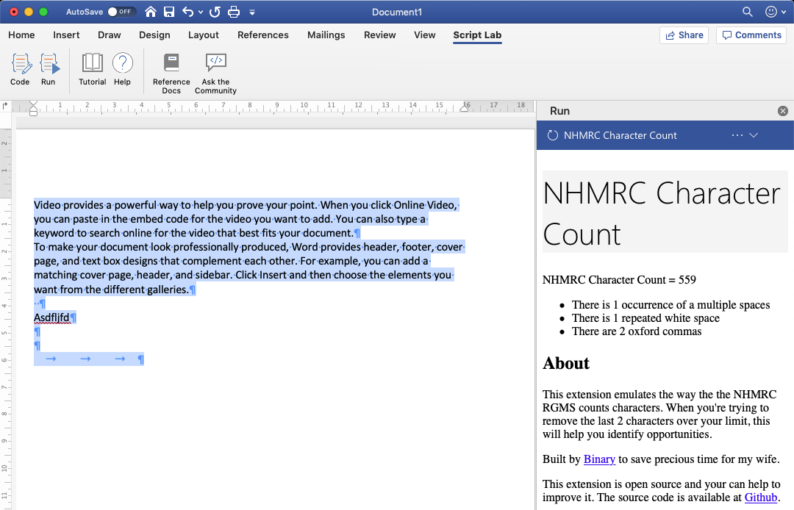

# NHMRC Character Count within MS Word

For all those submitting a grant to the NHMRC using their RGMS system I'm sure you're familiar with the write, copy, paste, check character count cycle. I have written a small Word plugin to get the NHMRC character count directly in word.

This simple addon, give you the character count for the selected text that will match up with the NHMRC character count from their webpage https://www.nhmrc.gov.au/rgms-character-count.

It also gives some hints on how you can reduce it by looking for some easy wins. It looks for any of the following:

- Double spaces
- Multiple white spaces (like a space followed by a tab)
- Any `, and` oxford commas

## Background

The NHMRC uses an online portal for their applications and the sections are often limited to a number of characters. However, their character count is always different from MS word. The reason is that NHMRC count new line characters twice (every new line counts for 2 characters). This simple extension allows you to see the NHMRC character count directly in word.

## Setup Instructions

To use this, you will need MS Word 2016. It _may_ with Word 2013, but I have not tested it.

1. Install the [Microsoft Script Lab Addon](https://store.office.com/app.aspx?assetid=WA104380862) into word.
1. Once you have the [Script Lab Addon](https://store.office.com/app.aspx?assetid=WA104380862) installed, click the `Script Lab` tab in your ribbon bar.
   
1. Click the `Code` button
1. In the left hand menu, click `Import`
   
1. Copy this link [https://gist.github.com/jmannau/2b7ba5901485146509d27f27f00f27f2](https://gist.github.com/jmannau/2b7ba5901485146509d27f27f00f27f2) and click `Import`
1. Once installed click the `Run` button in the ribbon bar
   
1. Highlight any text that you want to check the character count. The NHMRC character count will be displayed in the panel as well as any easy wins to reduce it.

## Development

Please feel free to update and improve it. If you do, it would be great to create a pull request and share those improvement everyone else.
